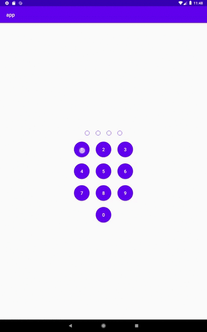

PincodeView
==

A custom view to enter a four digit code without keyboard



Usage
-

Add it in your root **build.gradle** at the end of repositories:
```
	allprojects {
		repositories {
			...
			maven { url 'https://jitpack.io' }
		}
	}
```
Add the dependency
```
dependencies {
	        implementation 'com.github.blazenn12:PinCodeView:TAG'
	}
```

Next we need to add xml to layout:
```
    <ru.zakharov.pincodeview.PinCodeView
        android:id="@+id/pincode"
        android:layout_width="match_parent"
        android:layout_height="match_parent" />

```

And get callback:

```
val SECRET_PIN = "1234";
val pinCodeView: PinCodeView = findViewById(R.id.pincode)
pinCodeView.onPinCodeEnterListener = this


    override fun onPinCodeAttempt(pinCode: String) {
        when (pinCode.equals(SECRET_PIN)) {
            true -> pinCodeView.onSuccess()
            false -> pinCodeView.onFail()
        }
    }
```

PincodeVie Attributes
-

|Attribute | Use|
---|:---:|
|PCV_buttonBackground| set backgroud to buttons|
|PCV_buttonTextColor| set text color to buttons |
|PCV_buttonTintColor| set button tint color to buttons|
|PCV_clearSrc| set drawable to clear button|
|PCV_clearBackground| set background to clear button|
|PCV_clearTint| set tint to clear button|
|PCV_pinsSrc| set src to all pins|
|PCV_pinColor| set color to all pins|
|PCV_enableSuccessAnimation| enable\disable success animation (default: true|
|PCV_enableFailAnimation| enable\disable fail animation (default: true)|

Change pins drawable
-

You can use your own drawable for the pin entry background by specifying the app:PCV_pinsSrc attribute in the xml. 

Example:

```
<?xml version="1.0" encoding="utf-8"?>
<selector xmlns:android="http://schemas.android.com/apk/res/android" android:enterFadeDuration="@android:integer/config_mediumAnimTime" android:exitFadeDuration="@android:integer/config_shortAnimTime">
    <item android:state_activated="true">
        <shape android:shape="oval">
            <solid android:color="?colorPrimary" />
            <size android:width="24dp" android:height="24dp" />
        </shape>
    </item>

    <item>
        <shape android:innerRadiusRatio="2" android:shape="ring" android:thickness="0dp" android:useLevel="false">
            <solid android:color="@android:color/transparent" />
            <stroke android:width="1dp" android:color="?colorPrimary" />
            <size android:width="24dp" android:height="24dp" />
        </shape>
    </item>
</selector>
```